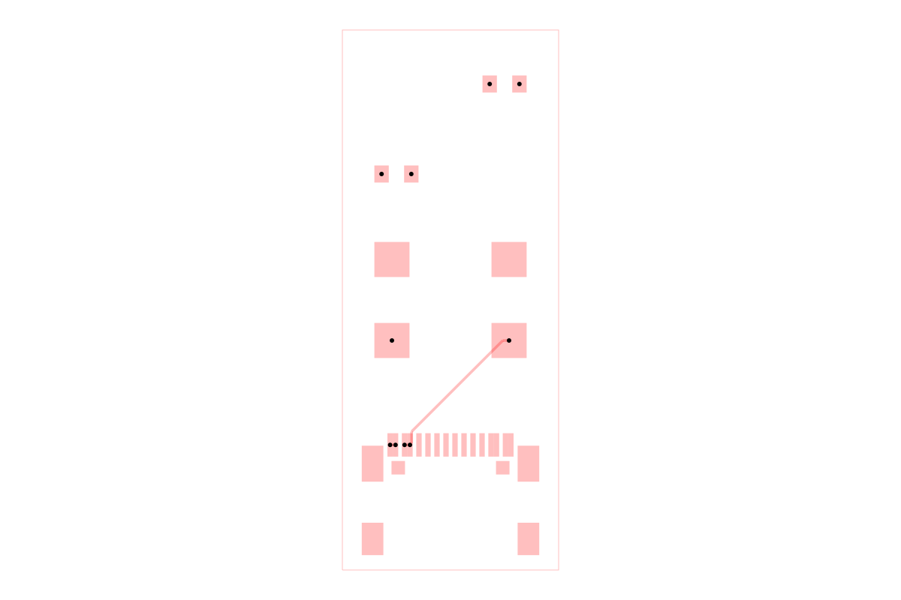

# dataset-srj28-partially-prerouted

Partially pre-routed Simple Route JSON benchmarks derived from every circuit in
[`tscircuit/autorouting-dataset-01`](https://github.com/tscircuit/autorouting-dataset-01).

Each source circuit is fully solved with
`AutoroutingPipelineSolver7_MultiGraph` from
[`@tscircuit/capacity-autorouter`](https://github.com/tscircuit/tscircuit-autorouter).
A seeded pseudo-random shuffle then removes 50% of the solved traces, rounded
down. The remaining traces are pre-routed obstacles for benchmarking routers
that must finish the board without disturbing valid existing routes.

The current generated set contains 85 partially pre-routed problems.

## Example

The image below shows `circuit001`, including its retained traces. It is
generated by constructing an `AutoroutingPipelineSolver`, calling
`.visualize()`, and converting the returned graphics object to SVG with
`graphics-debug`.



Regenerate it with `bun run generate:readme-image`. Run `bun run cosmos` to
browse the sample; `bun run build:site` exports the static catalog to
`cosmos-export/` for Vercel.

## Install

Datasets are installed directly from GitHub and are not published to npm:

```sh
bun add https://github.com/tscircuit/dataset-srj28-partially-prerouted
```

## Use

```ts
import { circuit001 } from "@tscircuit/dataset-srj28-partially-prerouted"
```

The package exposes the same named circuit exports as dataset01. Generation
details and per-circuit trace counts are recorded in `manifest.json`.

## Regenerate and validate

```sh
bun install
bun run generate
bun run check
```

Generation is deterministic for the pinned source dataset, Pipeline 7 version,
and selection seed in `scripts/generate-dataset.ts`.
